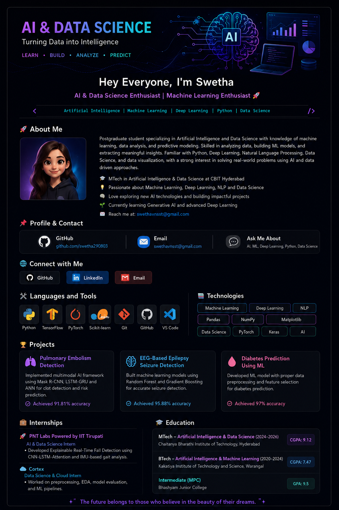

<h1 align="center">Hey Everyone 👋, I'm Swetha</h1>

<h3 align="center">
AI & Data Science Enthusiast | Machine Learning Enthusiast 🚀
</h3>

---

# 🚀 About Me

Postgraduate student specializing in Artificial Intelligence and Data Science with knowledge of machine 
learning, data analysis, and predictive modeling. Skilled in analyzing data, building ML models, and 
extracting meaningful insights. Familiar with Python, Deep Learning, Natural Language Processing, Data 
Science, and data visualization, with a strong interest in solving real-world problems using AI and data
driven approaches  

📫 Email: swethavnsst@gmail.com

🔗 LinkedIn: www.linkedin.com/in/sai-swetha-tadimeti/

💡 Ask me about AI, ML & Python

---

# 🌐 Connect with Me

---

# 🛠 Languages and Tools

---

# 📚 Technologies

- Machine Learning
- Deep Learning
- NLP
- TensorFlow
- Keras
- Scikit-learn
- Pandas
- NumPy
- Matplotlib
- Pytorch
- Data science 

---

# 🏆 Projects

## 🫁 Pulmonary Embolism Detection

Implemented multimodal AI framework using:

- Mask R-CNN
- LSTM-GRU
- ANN

✅ Achieved 91.81% accuracy

---

## 🧠 EEG-Based Epilepsy Seizure Detection

Built ML models using:

- Random Forest
- Gradient Boosting

✅ Achieved 95.88% accuracy

---

## 🩺 Diabetes Prediction Using Machine Learning

Built predictive ML model with:

- Feature Selection
- Data Preprocessing

✅ Achieved 97% accuracy

---

# 💼 Internships

## 🚀 PNT Labs Powered by IIT Tirupati

AI & Data Science Intern

---

## ☁️ Cortex

Data Science & Cloud Intern

---

# 🎓 Education

🎓 MTech – Artificial Intelligence & Data Science  
📍 CBIT Hyderabad  
📊 CGPA: 9.12

---

# 💡 Quote

> "AI is transforming the future 🚀"
